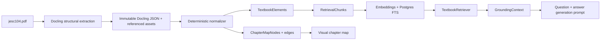

# NCERT RAG One-Chapter Implementation Plan

## Goal

Build and validate the complete NCERT-grounded generation path using one source
chapter, `jesc104.pdf` ("Carbon and its Compounds"), before processing the full
NCERT corpus.

The one-chapter MVP is complete when the system can:

1. deterministically transform the chapter PDF into inspectable structured data;
2. retrieve relevant NCERT passages with source citations;
3. show teachers and students a useful visual chapter map;
4. add retrieved passages to the question-and-answer generation prompt; and
5. prove generated output is supported by the retrieved NCERT context.

This is an offline, developer-populated corpus. Teachers do not upload or
re-index NCERT documents.

## Current Delivery Status

| Area | Status | Evidence / remaining work |
|---|---|---|
| One-chapter source selected | Complete | `jesc104.pdf`, "Carbon and its Compounds" |
| Extraction comparison | Complete | Corrected report and artifacts under `/Users/varad/Downloads/jesc104-extraction-comparison/` |
| Canonical extractor | Complete | Standard Docling 2.102.1 without formula enrichment |
| Visual source review | Complete for representative pages | Pages 1, 8, and 16 exposed known table/sidebar/reading-order losses |
| Production retrieval database decision | Complete | Existing Postgres plus pgvector and Postgres full-text search |
| Hosted vector database decision | Complete for MVP | TurboPuffer rejected for MVP |
| Corpus domain vocabulary | Proposed here | Must be added to `CONTEXT.md` before code |
| Corpus Django models and migrations | Not started | TextbookDocument, TextbookElement, ChapterMapNode/Edge, RetrievalChunk |
| Docling normalizer and importer | Not started | First implementation slice |
| Chapter-map API and frontend | Not started | Deterministic structure-first map |
| Embedding model selection | Not started | Requires measured local/provider comparison |
| pgvector installation/indexes | Not started | Existing Docker service still uses `postgres:16` |
| Hybrid retrieval and evaluation set | Not started | Requires chunks and selected embeddings |
| Grounded generation integration | Not started | Existing repository does not yet contain the planned QuestionGenerator foundation |

## Decisions Already Made

### Extraction

- Use **Docling 2.102.1 without formula enrichment** as the canonical extractor.
- Preserve Docling JSON, page coordinates, tables, referenced images, and page
  images.
- Do not use MarkItDown as the canonical source; it loses too much structure.
- Do not use Docling formula enrichment. The `jesc104` experiment took roughly
  40 minutes and produced unsafe corrupted chemistry and LaTeX.
- Do not require Marker for the MVP. Marker 1.10.2 did not produce output within
  the bounded experiment; the legacy Marker output was not reliable enough to
  justify a cross-tool merge.
- Preserve equations and diagrams as visual assets when trustworthy text is not
  available.

Experiment artifacts and the corrected decision are in:

```text
/Users/varad/Downloads/jesc104-extraction-comparison/
```

### Retrieval Storage

- Use the existing project **Postgres** service.
- Add **pgvector** for dense retrieval.
- Use native Postgres full-text search for lexical retrieval.
- Do not use TurboPuffer for the MVP: it has a $64/month minimum, no local
  emulator, and solves a scale problem this closed corpus does not have.
- Use RAGFlow only as an optional offline retrieval/chunking workbench. It must
  not be a production dependency.

### Topic Map

- Do not introduce the deferred canonical `Topic` model for bank questions.
  Existing `Question.topic_names` remains unchanged.
- The first chapter map is corpus-owned and derived from textbook structure.
- Prefer deterministic hierarchy and source-order edges over an LLM-invented
  knowledge graph.

### Visual Mapper Technology

- Use [`@xyflow/react`](https://github.com/xyflow/xyflow) with
  [`@dagrejs/dagre`](https://github.com/dagrejs/dagre) for the MVP visual
  mapper. Both are MIT-licensed.
- React Flow fits the existing React frontend and supports custom semantic
  nodes, selection, zoom/pan, and application-owned detail panels.
- Dagre provides a deterministic layered layout for the small hierarchy-first
  chapter graph. Layout coordinates remain frontend presentation state and are
  not stored in the canonical chapter-map API.
- Evaluate [`elkjs`](https://github.com/kieler/elkjs) only if Dagre cannot
  produce a readable layout for nested sections and cross-reference edges.
  ELK.js is more capable but adds complexity and uses the EPL-2.0 license.
- Evaluate [`Cytoscape.js`](https://github.com/cytoscape/cytoscape.js/) only if
  later requirements need graph analysis or dense conceptual-relationship
  exploration.
- Do not use Sigma.js/Graphology, Reagraph, or AntV G6 for the MVP. They are
  capable open-source graph renderers, but their large-network or broad
  graph-framework strengths do not justify their added complexity for a
  chapter-sized navigational map.
- The graph canvas is an enhancement, not the sole navigation surface. Provide
  a synchronized accessible outline and source-details panel.

### Grounded Generation

- Retrieval supplies NCERT excerpts and citations to the generation prompt.
- The model may generate only claims supported by supplied excerpts.
- Unsupported requests must be rejected rather than answered from model memory.
- Generated questions and answers remain reviewable candidates; retrieval does
  not make them automatically trusted.
- Numericals and diagram-dependent generation remain out of scope until their
  grounding and verification paths are separately validated.

## Proposed Domain Additions

Add these terms to `CONTEXT.md` before implementing their models/modules:

**TextbookDocument**
A canonical extracted NCERT chapter and its immutable extraction provenance.
For the first slice, one row represents the selected canonical extraction of
`jesc104.pdf`. Consumers address a specific TextbookDocument and must not
assume that a Chapter has only one extraction artifact.

**TextbookElement**
One source-addressable Docling element such as a heading, paragraph, table,
picture, or equation image. Retains page number, bounding box, source order,
text, structured payload, and asset reference.

**ChapterMapNode**
A corpus-owned navigational node derived from chapter headings and selected
content landmarks. It is distinct from the deferred bank-question `Topic`.

**ChapterMapEdge**
A typed relationship between ChapterMapNodes. MVP edge types are `contains`,
`next`, and `references`. LLM-inferred conceptual edges are deferred.

**RetrievalChunk**
A searchable group of adjacent TextbookElements. Stores citation metadata,
lexical-search data, and one embedding.

**GroundingContext**
The ordered, citation-bearing RetrievalChunks supplied to question-and-answer
generation.

**TextbookRetriever**
Provider-neutral retrieval seam:
`retrieve(request) -> GroundingContext`. Its first adapter uses Postgres.

## Target Data Model

The exact Django field definitions should be finalized during implementation,
but the ownership boundaries should remain:

All textbook corpus models, import behavior, chapter-map derivation, retrieval,
and grounding live in a dedicated `corpus` Django module. The existing `bank`
module continues to own Questions and the shared canonical Chapter taxonomy.
`corpus` references `bank.Chapter`; `bank` does not own or import corpus
lifecycle behavior.

### `TextbookDocument`

```text
chapter FK -> existing Chapter
source_file_name
source_hash
extractor_name
extractor_version
canonical_json_path
canonical_json_hash
page_count
created_at
```

Different canonical artifact hashes are separate immutable TextbookDocuments,
even when they came from the same Chapter and source PDF. Map, retrieval, and
grounding APIs therefore accept an explicit TextbookDocument identity rather
than resolving one implicitly from Chapter alone.

### `TextbookElement`

```text
document FK
stable_element_id
element_type
source_order
page_number
bbox JSON
heading_path JSON
text
structured_data JSON
asset_path
```

### `ChapterMapNode` and `ChapterMapEdge`

```text
node:
  document FK
  stable_node_id
  label
  node_type
  parent FK nullable
  source_element FK nullable
  source_order_start / source_order_end
  page_start / page_end
  summary nullable

edge:
  document FK
  source_node FK
  target_node FK
  edge_type
  evidence_element FK nullable
```

Section/topic ChapterMapNodes partition the TextbookDocument into deterministic,
non-overlapping source-order ranges. Every retrievable TextbookElement resolves
to exactly one nearest section/topic node. Landmark nodes provide navigation and
evidence but do not create ambiguous retrieval ownership.

### `RetrievalChunk`

```text
document FK
chapter FK
chapter_map_node FK nullable
stable_chunk_id
text
element_ids JSON
page_start / page_end
content_types JSON
search_vector
embedding vector
embedding_model
embedding_version
```

Do not attach NCERT chunks directly to `Question`. Generated candidates should
instead carry retrieval citations in their generation provenance when that
generation model is implemented.

## Pipeline



## Execution Plan

### Phase 0: Lock the One-Chapter Fixture

1. Copy or reference the selected standard Docling JSON and its assets from the
   experiment directory into a developer-controlled corpus location.
2. Record the PDF hash, Docling version, extraction command, and artifact hash.
3. Commit a small representative fixture for automated tests; do not commit the
   full 14 MB extraction unless repository policy explicitly allows it.
4. Create a manual quality manifest for representative pages:
   - page 1: chapter opening, Activity 4.1, and table;
   - page 8: structural diagrams and captions;
   - page 16: sidebars, activities, reaction, and labelled apparatus.

**Exit criterion:** extraction is reproducible and known losses are documented.

### Phase 1: Normalize Docling JSON

1. Implement a pure `DoclingNormalizer` that converts Docling JSON into ordered
   TextbookElement records.
2. Preserve page number, bounding box, element type, source order, table
   structure, and referenced asset.
3. Build heading paths using deterministic source order and heading levels.
4. Add deterministic cleanup rules only for demonstrated defects:
   duplicate headings, decorative noise, page headers/footers, and empty text.
5. Never replace uncertain source content with inferred text.
6. Add an idempotent management command for one document.

**Exit criterion:** repeated normalization produces identical stable element IDs
and no duplicate rows.

### Phase 2: Build the Chapter Map

1. Create one ChapterMapNode per meaningful heading.
2. Add selected landmark nodes for activities, tables, exercises, and figures.
3. Add deterministic edges:
   - `contains`: heading hierarchy;
   - `next`: source sequence among siblings;
   - `references`: explicit caption/text references such as "Fig. 4.11".
4. Compute node page ranges and element counts.
5. Expose a read-only chapter-map API returning stable semantic data, not
   renderer-specific positions:

   ```json
   {
     "chapter": {"id": "...", "title": "..."},
     "nodes": [
       {
         "id": "...",
         "label": "...",
         "node_type": "section",
         "parent_id": "...",
         "page_start": 1,
         "page_end": 2,
         "element_count": 8,
         "preview": "..."
       }
     ],
     "edges": [
       {
         "id": "...",
         "source": "...",
         "target": "...",
         "edge_type": "contains",
         "evidence_element_id": null
       }
     ]
   }
   ```

6. Run a bounded frontend spike using React Flow and Dagre with a fixture of
   40-100 nodes. Confirm deterministic layout, acceptable bundle impact, and
   responsive behavior before building the full mapper.
7. Build three synchronized surfaces:
   - an accessible collapsible outline for primary navigation;
   - a focused hierarchy graph for visual orientation;
   - a source-details panel showing the selected excerpt, page, element type,
     and available assets.
8. Provide a default **Learn** view showing chapter, sections, topics, and
   landmarks. Keep optional `references` connections hidden by default to avoid
   an unreadable graph.
9. Support search, collapse/expand, and filters for sections, activities,
   figures, tables, and exercises.
10. Selecting a node by mouse or keyboard must update the outline, graph, and
    source-details panel consistently.
11. Render only the selected or expanded subtree when the complete graph would
    reduce readability.

Do not use an LLM to create map edges in the MVP. A later experiment may add
evidence-backed conceptual edges, but deterministic structure remains canonical.

**Exit criterion:** a teacher can navigate from the chapter root to a topic and
inspect the supporting NCERT source using either the outline or graph.

### Visual Mapper Research Matrix

| Tool | License | Strength | Decision |
|---|---|---|---|
| [React Flow](https://github.com/xyflow/xyflow) + [Dagre](https://github.com/dagrejs/dagre) | MIT + MIT | React-native custom nodes and deterministic layered layout | Selected for MVP |
| [ELK.js](https://github.com/kieler/elkjs) | EPL-2.0 | Sophisticated layered and nested layouts | Fallback if Dagre fails the spike |
| [Cytoscape.js](https://github.com/cytoscape/cytoscape.js/) | MIT | Mature graph analysis and visualization | Later fallback for conceptual graph analysis |
| [AntV G6](https://github.com/antvis/G6) | MIT | Broad graph visualization, layout, and analysis framework | Viable, but unnecessary for the MVP |
| [Sigma.js](https://github.com/jacomyal/sigma.js) + [Graphology](https://github.com/graphology/graphology) | MIT | WebGL rendering and analysis for large networks | Not selected; optimized for a different scale and graph shape |
| [Reagraph](https://github.com/reaviz/reagraph) | Apache-2.0 | React and WebGL network visualization | Not selected; dependency-heavy for a small chapter map |

The selection should be revisited only when the bounded React Flow/Dagre spike
fails a documented acceptance criterion. Tool novelty alone is not a reason to
change the stack.

### Phase 3: Create Retrieval Chunks

1. Chunk within ChapterMapNode boundaries rather than across arbitrary token
   windows.
2. Keep tables, activity instructions, exercises, and captions as identifiable
   content types.
3. Group adjacent paragraphs until a configurable size limit is reached.
4. Add small parent-heading context to each chunk.
5. Never merge across major section boundaries.
6. Keep stable chunk IDs derived from document hash plus source element IDs.
7. Store citation metadata on every chunk.

**Exit criterion:** every chunk can be traced back to exact elements and pages.

### Phase 4: Select and Populate Embeddings

Embedding selection is not yet complete. Treat it as a measured gate:

1. Create a provider-neutral `EmbeddingClient` seam.
2. Compare at least one local embedding model and the intended production
   embedding provider using the same retrieval evaluation set.
3. Do not invoke a paid embedding API without explicit consent.
4. Fix embedding dimensions only after selecting the model.
5. Switch the Docker Postgres image to a pgvector-compatible Postgres 16 image.
6. Add the extension and vector indexes through Django migrations.
7. Populate embeddings idempotently and record model/version per chunk.

**Exit criterion:** the chosen embedding configuration beats lexical-only
retrieval on the one-chapter evaluation set.

### Phase 5: Implement Hybrid Retrieval

1. Define `TextbookRetrievalRequest` with deterministic filters:
   chapter slug, optional ChapterMapNode IDs, content types, query text, and
   result limit.
2. Retrieve lexical and dense candidates independently.
3. Combine rankings using a simple deterministic method such as reciprocal rank
   fusion.
4. Return bounded GroundingContext ordered by final rank, with citations.
5. Enforce a maximum context budget and remove duplicate/overlapping chunks.
6. Log retrieval diagnostics without storing prompt secrets.

Build a hand-reviewed evaluation set of approximately 20 queries covering:
definitions, explanations, reactions, activities, tables, exercises, and
queries that should return no supported answer.

**Exit criterion:** target passages appear in the top results for the agreed
evaluation threshold, and unsupported queries return insufficient-context.

### Phase 6: Ground Question-and-Answer Generation

1. Keep retrieval separate from the provider-neutral QuestionGenerator.
2. Build a grounding manifest containing:
   - chapter and requested topics;
   - retrieved excerpts;
   - stable citation IDs and pages;
   - explicit unsupported-content policy.
3. Update the generation prompt to require:
   - NCERT-faithful terminology and scope;
   - claims supported only by supplied excerpts;
   - citations for the question and answer;
   - refusal when context is insufficient;
   - the provider-enforced response schema planned by the generation
     foundation work.
4. Validate returned citations against the supplied GroundingContext.
5. Reject candidates with missing, unknown, or contradictory citations.
6. Compare grounded output against the earlier ungrounded model experiment.

Do not persist generated candidates into the trusted Question bank until the
generation/review issue defines their provenance and review lifecycle.

**Exit criterion:** a reviewed batch demonstrates improved NCERT relevance and
all accepted question/answer pairs have valid source citations.

### Phase 7: One-Chapter Acceptance Review

Before expanding beyond `jesc104`:

1. Review extraction losses and retrieval misses.
2. Measure ingestion time, chunk count, index size, retrieval latency, and
   prompt context size.
3. Review chapter-map usefulness with at least one teacher/student workflow.
4. Run deterministic tests and the required Antigravity code review.
5. Record whether any failures require a second extraction tool.

Only then batch-process the remaining NCERT chapters.

## Testing Strategy

### Deterministic tests

- Docling normalization fixture tests.
- Stable ID and idempotent re-import tests.
- Heading hierarchy and edge-construction tests.
- Chapter-map API contract and source-evidence tests.
- Deterministic frontend layout-helper tests.
- Visual-map search, filters, and collapse/expand tests.
- Accessible outline keyboard-navigation and graph-selection synchronization
  tests.
- Chunk-boundary and citation tests.
- Postgres filtering and full-text tests.
- Vector retrieval integration tests with fixed embeddings.
- Hybrid ranking tests with synthetic scores.
- Grounding-context budget and de-duplication tests.
- Citation validation and unsupported-context rejection tests.

### Evaluation artifacts

- Hand-reviewed extraction quality manifest.
- Hand-reviewed retrieval query set.
- Grounded versus ungrounded generation comparison.
- Chapter-map navigation review notes.
- Visual-mapper spike measurements and acceptance notes.

LLMs may propose or summarize evaluation findings, but deterministic code owns
IDs, filtering, ranking combination, validation, and pass/fail calculations.

## Parallel Execution with `codex-agy-bridge`

The bridge now supports goal-level orchestration:

- `agy_goal_create`: creates the parent objective and bounded parallelism.
- `agy_goal_target_start`: starts named Gemini 3.5 Flash Medium targets.
- `agy_goal_status`: returns compact aggregate target status.
- `agy_target_open_terminal`: reopens a persistent target terminal.

Each visible target runs in its own `tmux` session. Closing Terminal.app
detaches the viewer but does not stop the target.

Suggested implementation goal:

```text
goal: jesc104-rag-mvp
├── target: normalizer-and-fixtures
├── target: chapter-map-api
├── target: embedding-evaluation
├── target: retrieval-evaluation
└── target: grounding-prompt-review
```

Targets may research, draft tests, inspect artifacts, and produce reports in
parallel. Codex remains responsible for integration decisions, accepted edits,
verification, and final review.

## Explicit Deferrals

- Full NCERT corpus ingestion.
- LLM-created conceptual knowledge graph.
- Canonicalising existing `Question.topic_names`.
- Multimodal retrieval over diagram pixels.
- Generated diagram or numerical questions.
- Teacher-uploaded textbook corpora.
- TurboPuffer or another hosted vector database.
- RAGFlow as a production service.

## Immediate Next Slice

Implement Phases 0 and 1 only:

1. define the new domain terms in `CONTEXT.md`;
2. add the textbook corpus models needed by normalization;
3. add a small committed `jesc104` Docling fixture;
4. implement and test the deterministic DoclingNormalizer; and
5. populate the one-chapter TextbookElements idempotently.

Do not add embeddings, retrieval, generation calls, or visual UI in this first
slice. The slice succeeds when the source chapter is reproducibly represented
inside Postgres with citations and known extraction losses intact.
